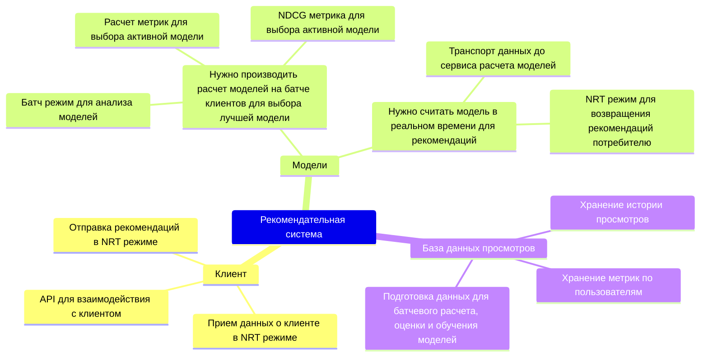
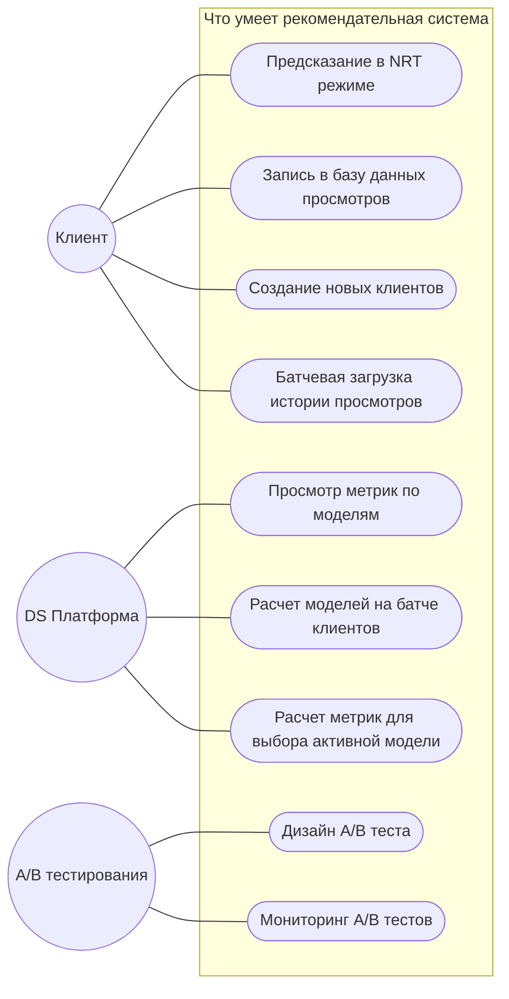
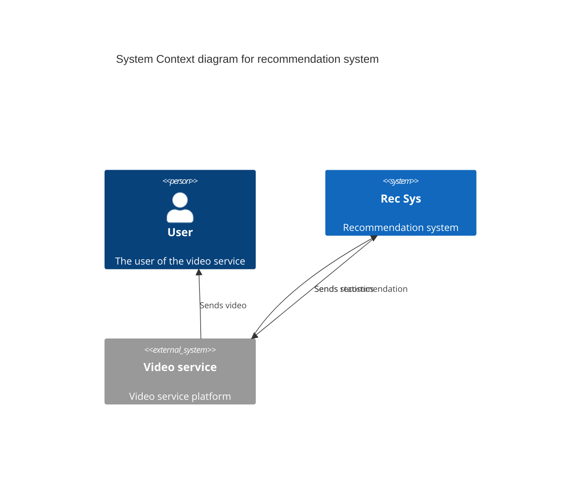

# Case

Нужно разработать рекомендательную систему с 3 моделями:

* которые учитывают видео, просмотренные пользователем за последние 10мин,
* активная выбирается по метрике NDCG каждую неделю по результатам A / B теста

## Mindmap

## Use Cases

# C4

## Context

## Containers

## Components

