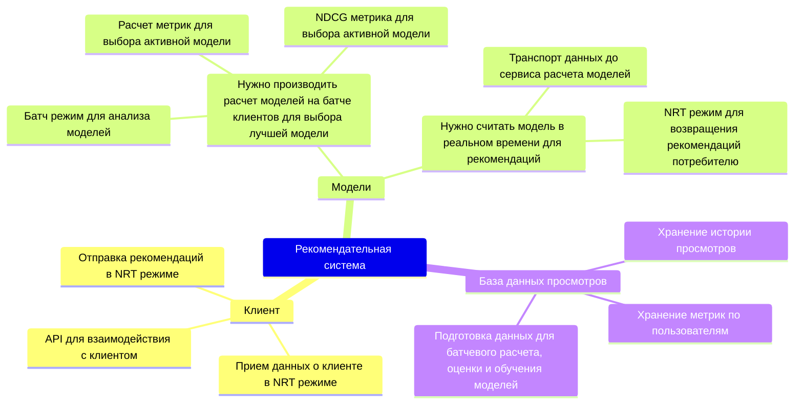

# Case

Нужно разработать рекомендательную систему с 3 моделями:

* которые учитывают видео, просмотренные пользователем за последние 10мин,
* активная выбирается по метрике NDCG каждую неделю по результатам A / B теста

## Mindmap



## Use Cases


# C4

## Context

```puml
@startuml
!if %variable_exists("RELATIVE_INCLUDE")
  !include %get_variable_value("RELATIVE_INCLUDE")/C4_Container.puml
!else
  !include https://raw.githubusercontent.com/plantuml-stdlib/C4-PlantUML/master/C4_Container.puml
!endif

SHOW_PERSON_OUTLINE()

title Context Diagram for Recomendation System
    Person_Ext(customer, Customer, "A customer of video service, who can watch videos based on their preferences and history")
    System_Ext(video_service, "Video service", "A service that provides videos to customers")
    Container(rec_sys, "Recommendation System", "Spark, S3, K8S", "Recommends videos to customers based on their preferences and history")

Rel(customer, video_service, "Watch videos")
Rel_Back(customer, video_service, "Suggest video")
Rel(video_service, rec_sys, "Gives customer watch history")
Rel_Back(video_service, rec_sys, "Suggest video")

SHOW_LEGEND()
@enduml
```


## Containers


## Components


